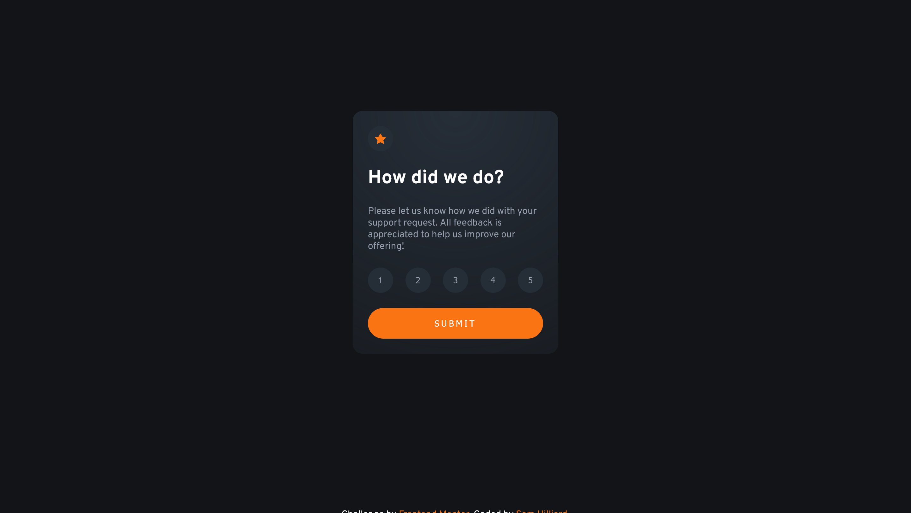
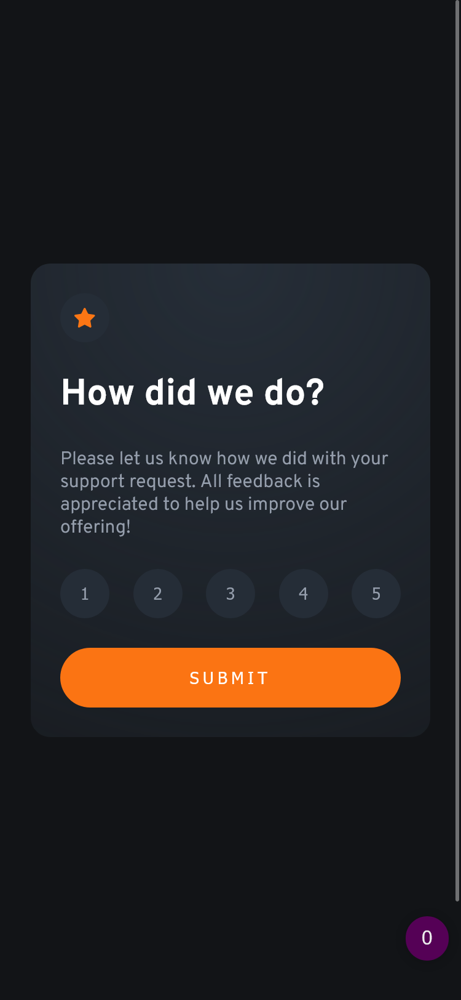

# Frontend Mentor - Interactive rating component solution

This is a solution to the [Interactive rating component challenge on Frontend Mentor](https://www.frontendmentor.io/challenges/interactive-rating-component-koxpeBUmI). Frontend Mentor challenges help you improve your coding skills by building realistic projects. 

## Table of contents

- [Frontend Mentor - Interactive rating component solution](#frontend-mentor---interactive-rating-component-solution)
  - [Table of contents](#table-of-contents)
  - [Overview](#overview)
    - [The challenge](#the-challenge)
    - [Screenshot](#screenshot)
    - [Links](#links)
  - [My process](#my-process)
    - [Built with](#built-with)
    - [What I learned](#what-i-learned)
    - [Continued development](#continued-development)
    - [Useful resources](#useful-resources)
  - [Author](#author)
  - [Acknowledgments](#acknowledgments)

## Overview

### The challenge

Users should be able to:

- View the optimal layout for the app depending on their device's screen size
- See hover states for all interactive elements on the page
- Select and submit a number rating
- See the "Thank you" card state after submitting a rating

### Screenshot

### Links

- Solution URL: [github repo](https://github.com/sam-hilliard/interactive-rating-component)
- Live Site URL: [site](https://sam-hilliard.github.io/interactive-rating-component/)

## My process

### Built with

- CSS Grid
- Flexbox for positioning

### What I learned

I haven't used vanilla Javascript in a while (mostly rely on React for projects)
so this was a great refresher!

### Continued development

If I were to improve on this, I would add some error handling and popup indications
notifying the user if their submission was successful or not.

### Useful resources

- [This Medium Article](https://javascript.plainenglish.io/how-to-get-the-id-of-the-clicked-element-in-the-javascript-click-handler-8ca398d848d6) helped me to differentiate which button was clicked when my click handler was fired.

## Author

- Website - [Sam Hilliard](https://sam-hilliard.github.io/)
- Frontend Mentor - [@samhill15](https://www.frontendmentor.io/profile/samhill15)

## Acknowledgments

Hats off to [Kevin Powell's YouTube Courses](https://www.youtube.com/channel/UCJZv4d5rbIKd4QHMPkcABCw) for keeping me motivated to learn front-end development!